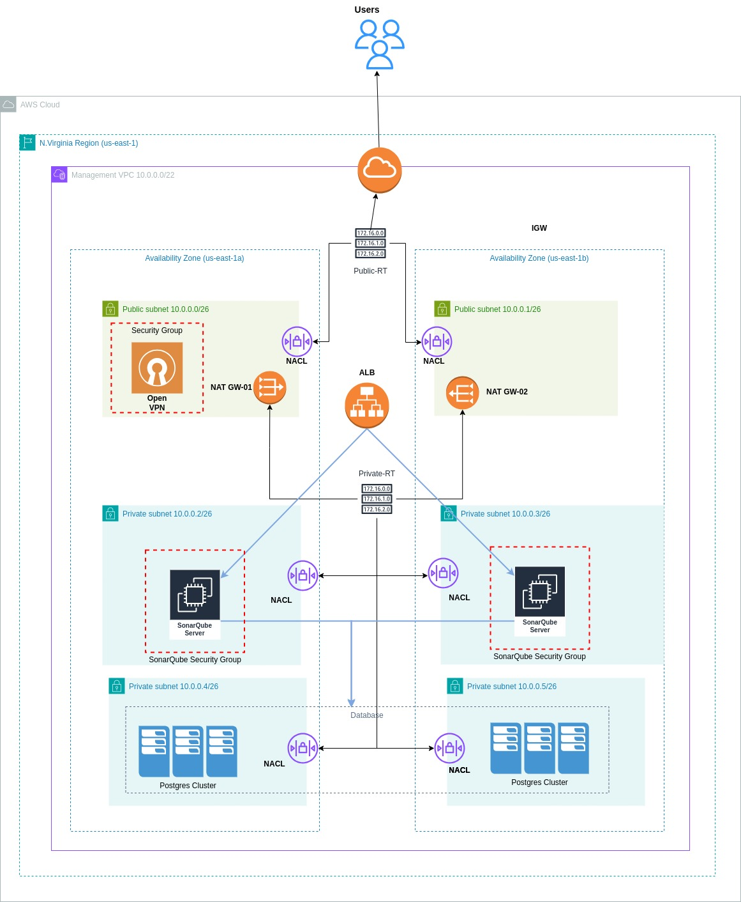

# High Availability in Sonarqube

| Author                                                           | Created on  | Version    | Last Updated by | Last Updated on |
| ---------------------------------------------------------------- | ----------- | ---------- | --------------- | --------------- |
| **[Harshit Singh](https://github.com/Panu-S-Harshit-Ninja-07)**  | 02-02-2024  | 1.0        | Harshit Singh   | 03-02-2024      |

## Table  of Contents

1. [Introduction](#Introduction)
2. [Conclusion](#Conclusion)
3. [Contact Information](#Contact-Information)
4. [References](#References)
***

## Introduction 

***
## What
High availability (HA) is the elimination of single points of failure to enable applications to continue to operate even if one of the IT components it depends on, such as a server, fails. IT professionals eliminate single points of failure to ensure continuous operation and uptime at least 99.99% annually.

High availability clusters are groups of servers that support business-critical applications. Applications are run on a primary server and in the event of a failure, application operation is moved to secondary server(s) where they continue to operate.
***
## Why 
To reduce interruptions and downtime, it is essential to be ready for unexpected events that can bring down servers. At times, emergencies will bring down even the most robust, reliable software and systems. Highly available systems minimize the impact of these events, and can often recover automatically from component or even server failures. [Click Here](https://avinetworks.com/glossary/high-availability/), to know more about HA.
***
> [!IMPORTANT]
> If you want to run SonarQube as a Cluster, it is only possible with a `Data Center Edition`.
> Below is an alternative approach with Sonarqube+AWS to provide HA.
## Requirements
| Requirement | Description |
| ----------- | ----------- |
| **Network**     | - You need a minimum of five servers (two application nodes and three search nodes) to form a SonarQube application cluster. - The operating system requirements for servers are available on the [Requirements](https://docs.sonarsource.com/sonarqube/latest/requirements/prerequisites-and-overview/) page. - All application nodes should be identical in terms of hardware and software. Similarly, all search nodes should be identical to each other. - In this case, each search node should be located in a separate availability zone to maintain availability in the event of a failure in one zone. |
|  **Database server** |Supported database`i.e. (Postgres, Microsoft SQl, Oracle)` systems detailed information in available on the [Requirements](https://docs.sonarsource.com/sonarqube/latest/requirements/prerequisites-and-overview/) page. |
|**Load balancer**| AWS ALB |
| **License** | You need a dedicated license to activate the Data Center Edition. If you don't have one yet, please contact the SonarSource Sales Team. |
| **Support** | Don't start this journey alone! As a Data Center Edition subscriber, SonarSource will assist with the setup and configuration of your cluster. Get in touch with [SonarSource Support](https://sonarsource.atlassian.net/servicedesk/customer/user/login?destination=portals) for help.
## Diagram
 

## Conclusion
***

## Contact Information

|     Name         | Email  |
| -----------------| ------------------------------------ |
| Harshit Singh    | harshit.singh.snaatak@mygurukulam.co |
***

## References

| Description                                   | References  
| --------------------------------------------  | -------------------------------------------------|
| What is HA?                                   | https://avinetworks.com/glossary/high-availability/ |
| High Availability and Scalability - ELB & ASG | https://zhenye-na.github.io/aws-certs-cheatsheet/posts/ha-elb-asg/#:~:text=Auto%20Scaling%20Group%20(ASG),instances%20to%20a%20load%20balancer |
